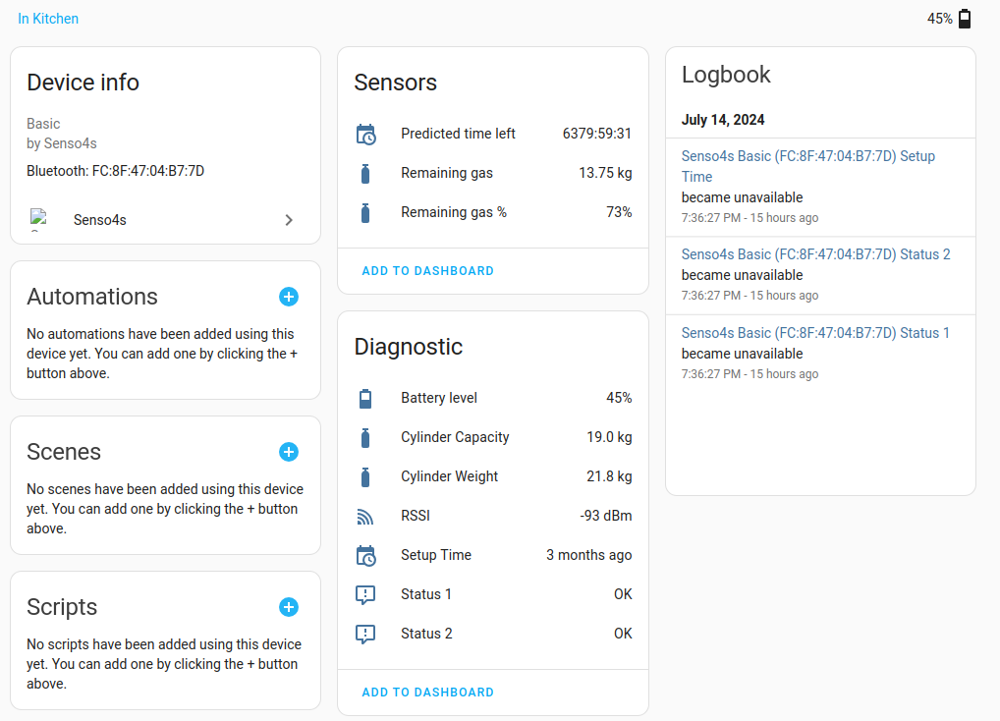
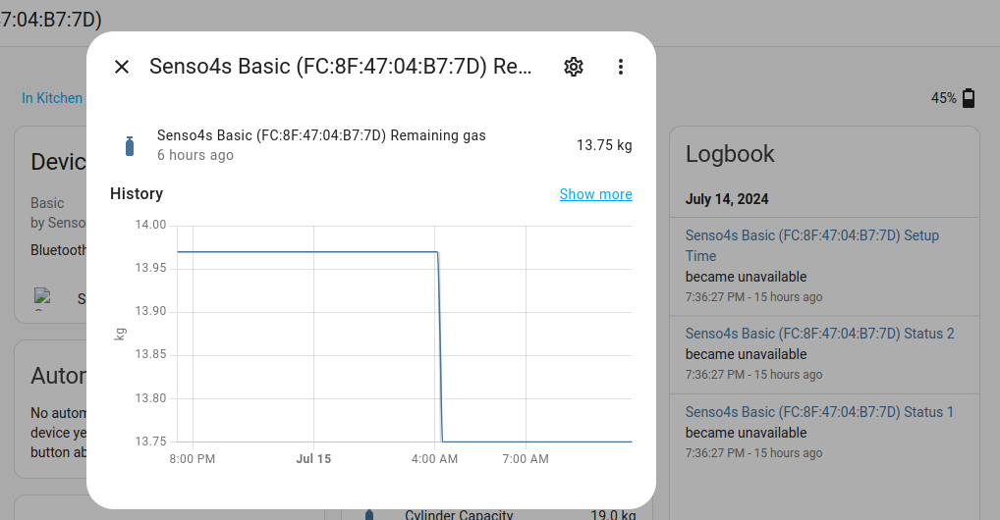

# Senso4s Home Assistant integration

## Manual Installation

* Clone this repository
* Copy the directory `custom_components/senso4s` to the `custom_components` directory of your Home Assistant installation
* Restart Home Assistant

## Adding the device to Home Assistant

* In Home Assistant's web UI, go to Settings, Devices & Services
* In the bottom right hand corner, click on `+ Add integration`
* In the search box type `Senso4s`, and choose `Senso4s` in the list shown
** If nothing is found, review the installation steps
* The following screen will show all Bluetooth devices that have been recognised as manufactured by Senso4s
** If you do not see any devices listed, or the message "No devices found on the network", try going closer to your Senso4s device
* After selecting the device, Home Assistant will attempt to read data from it. When that is done you will be greeted by 'n screen asking in which area the device should be classified. You can choose a room, or skip it.

## View data

* After the device has been added, go to Settings, Devices & Services, and select Senso4s
* You should see the Senso4s device listed with its MAC address
* Under the device it should read "1 device and 10 entities"
* Click on the "1 device" hyperlink to see a summary of all the device's sensors
* You can click on any of the sensors to see a graph of its history

