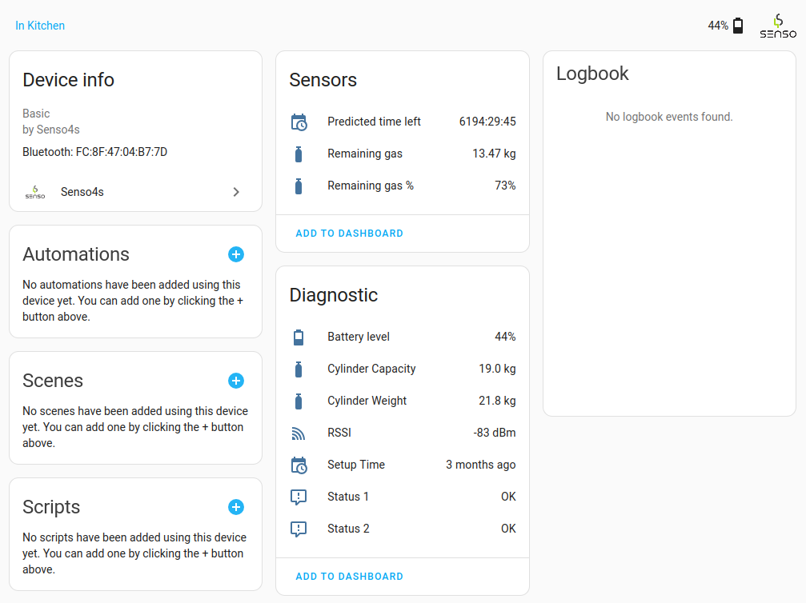

# Senso4s Home Assistant integration

This integration adds support for the [Senso4s PLUS](https://www.senso4s.com/product/senso4s-plus/) and [Senso4s BASIC](https://www.senso4s.com/product/senso4s-basic/) smart gas level solutions to Home Assistant.
Senso4s devices use Bluetooth to communicate, so your Home Assistant installation needs to have a [Bluetooth adapter or Bluetooth Proxy available](https://www.home-assistant.io/integrations/bluetooth/).
Setup of a Senso4s device is done using the [Senso4s Android App](https://play.google.com/store/apps/details?id=com.companyname.Senso4sProject&hl=en_ZA&pli=1) or [Senso4s iOS App](https://apps.apple.com/us/app/senso4s/id1447741983).
After the setup of a Senso4s device is completed, you can check the remaining gas level, gas level consumption history, estimated running-out-of-gas time, battery status, and other parameters either via the Senso4s app or this Home Assistant integration.

## Quick Install using HACS

You must have HACS installed: https://hacs.xyz/docs/use/

Click the button below to add the Senso4s integration to your Home Assistant.

After adding the Senso4s integration to HACS, you can click Download on the Senso4s repository. Once done, you will be requested to restart Home Assistant.

## Manual Installation

- Clone this repository.
- Copy the directory `custom_components/senso4s` to the `custom_components` directory of your Home Assistant installation.
- Restart Home Assistant.

## Adding a Senso4s device to Home Assistant

- In the Home Assistant's web UI, go to Settings, Devices & Services.
- In the bottom right-hand corner, click on `+ Add integration`.
- In the search box type `Senso4s`, and choose `Senso4s` in the list shown.
  \*\* If nothing is found, review the installation steps.
- The following screen will show all Bluetooth devices that have been recognised as manufactured by Senso4s.
  \*\* If you do not see any devices listed, or the message "No devices found on the network", try going closer to your Senso4s device.
- After selecting your Senso4s device from the list, the Home Assistant will attempt to read the data. Once done, you will be greeted by a screen asking which place your Senso4s device should be associated with. You can choose a place or skip this step.

## View data

- After the device has been added, go to Settings, Devices & Services, and select Senso4s.
- You should see the Senso4s device with its MAC address listed.
- Under the device it should read "1 device and 10 entities".
- Click on the "1 device" hyperlink to see a summary of all the Senso4s device's parameters.
- You can click on any of the parameters to see a chart showing its changes over time.

